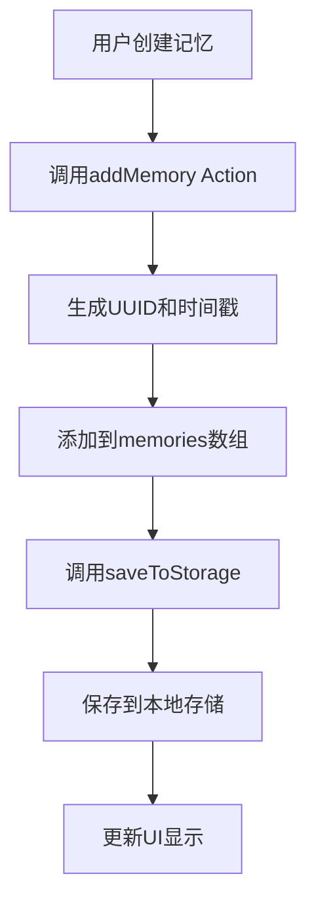
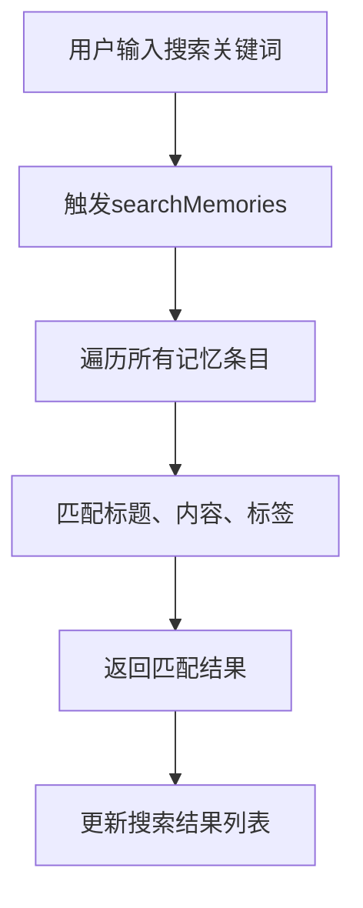
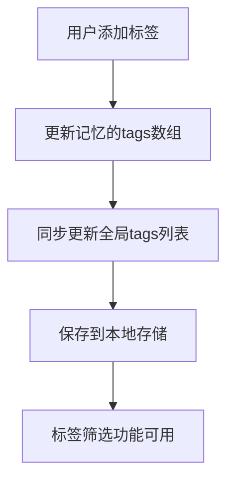

# 记忆仓库系统模式 (Memory Warehouse System Patterns)

## 系统架构

### 整体架构设计

```
┌─────────────────────────────────────────────────────────────┐
│                    微信小程序运行环境                        │
├─────────────────────────────────────────────────────────────┤
│                    View Layer (视图层)                      │
│  ┌─────────────┐  ┌─────────────┐  ┌─────────────┐  ┌───────┐│
│  │   首页组件   │  │   详情组件   │  │   编辑组件   │  │ 搜索组件 ││
│  │ Index Page  │  │ Detail Page │  │  Edit Page  │  │Search ││
│  └─────────────┘  └─────────────┘  └─────────────┘  └───────┘│
├─────────────────────────────────────────────────────────────┤
│                 ViewModel Layer (视图模型层)                │
│  ┌─────────────────────────────────────────────────────────┐│
│  │                    Pinia 状态管理                      ││
│  │  ┌─────────────┐  ┌─────────────────────────────────┐  ││
│  │  │  MemoryStore │  │           Getters            │  ││
│  │  │ - memories   │  │ - sortedMemories             │  ││
│  │  │ - tags       │  │ - allTags                   │  ││
│  │  │ - isLoading  │  │ - memoryCount               │  ││
│  │  └─────────────┘  │ - searchResults             │  ││
│  │                   └─────────────────────────────────┘  ││
│  │  ┌─────────────────────────────────────────────────────┐││
│  │  │                     Actions                      │││
│  │  │ - addMemory()                                    │││
│  │  │ - updateMemory()                                 │││
│  │  │ - deleteMemory()                                 │││
│  │  │ - searchMemories()                               │││
│  │  │ - initialize()                                   │││
│  │  └─────────────────────────────────────────────────────┘││
│  └─────────────────────────────────────────────────────────┘│
├─────────────────────────────────────────────────────────────┤
│                   Service Layer (服务层)                   │
│  ┌─────────────────────────────────────────────────────────┐│
│  │                   本地存储服务                         ││
│  │  ┌─────────────┐  ┌─────────────────────────────────┐  ││
│  │  │ Storage API │  │         Storage Keys         │  ││
│  │  │ - setStorage()│  │ - MEMORIES: 'memory_warehouse_memories'││
│  │  │ - getStorage()│  │ - TAGS: 'memory_warehouse_tags'     ││
│  │  │ - removeStorage()│  └─────────────────────────────────┘  ││
│  │  │ - clearStorage()│                                      ││
│  │  └─────────────┘                                           ││
│  └─────────────────────────────────────────────────────────┘│
└─────────────────────────────────────────────────────────────┘
```

### 技术栈架构

- **框架层**: uni-app (Vue 3 Composition API)
- **状态管理层**: Pinia
- **数据存储层**: 微信小程序本地存储 API
- **UI 组件层**: 原生组件 + 自定义样式
- **样式系统层**: SCSS + 设计令牌系统
- **构建工具**: Vite

## 关键技术决策

### 1. 状态管理选择

**决策**: 使用 Pinia 而非 Vuex
**理由**:

- Pinia 是 Vue 3 推荐的状态管理方案
- 更简洁的 API 设计
- 更好的 TypeScript 支持
- 更小的包体积
- 更直观的模块化设计

### 2. 数据存储策略

**决策**: 纯本地存储，不使用云开发
**理由**:

- 满足用户隐私保护需求
- 降低使用门槛（无需注册账户）
- 提高应用响应速度
- 减少网络依赖

### 3. 组件设计模式

**决策**: 基于页面的组件化设计
**理由**:

- 微信小程序的页面导航机制
- 保持代码结构清晰
- 便于状态管理和数据传递
- 符合小程序开发规范

### 4. 搜索算法选择

**决策**: 客户端全文搜索
**理由**:

- 数据量适中，本地搜索性能足够
- 无需网络请求，响应快速
- 实现简单，维护成本低
- 用户体验流畅

## 使用的设计模式

### 1. 单一状态源模式 (Single Source of Truth)

```javascript
// store/modules/memory.js
export const useMemoryStore = defineStore("memory", () => {
  const memories = ref([]); // 唯一的记忆数据源
  const tags = ref([]); // 唯一的标签数据源
});
```

### 2. 计算属性模式 (Computed Properties)

```javascript
// 基于原始数据的派生数据
const sortedMemories = computed(() => {
  return [...memories.value].sort((a, b) => {
    return new Date(b.updateTime) - new Date(a.updateTime);
  });
});

const allTags = computed(() => {
  // 从记忆数据中派生出所有标签
  const tagSet = new Set();
  memories.value.forEach((memory) => {
    if (memory.tags && Array.isArray(memory.tags)) {
      memory.tags.forEach((tag) => tagSet.add(tag));
    }
  });
  return Array.from(tagSet);
});
```

### 3. 服务封装模式 (Service Encapsulation)

```javascript
// utils/storage.js
class StorageService {
  static async set(key, data) {
    /* 封装存储逻辑 */
  }
  static async get(key) {
    /* 封装获取逻辑 */
  }
  static async remove(key) {
    /* 封装删除逻辑 */
  }
}
```

### 4. 组合式 API 模式 (Composition API)

```javascript
// pages/index/index.vue
export default {
  setup() {
    const memoryStore = useMemoryStore();
    const searchKeyword = ref("");

    // 组合相关的逻辑
    const filteredMemories = computed(() => {
      // 搜索和筛选逻辑组合
    });

    return {
      searchKeyword,
      filteredMemories,
      // 返回给模板使用的数据和方法
    };
  },
};
```

### 5. 设计令牌模式 (Design Tokens) - 新增

```scss
// styles/variables.scss
// 统一的设计令牌系统
$primary-color: #5b8dee;
$spacing-xs: 8rpx;
$font-base: 28rpx;
$radius-md: 12rpx;
$shadow-md: 0 4rpx 6rpx -1rpx rgba(0, 0, 0, 0.1);

// 所有组件使用统一的设计令牌
.card {
  padding: $spacing-lg;
  border-radius: $radius-md;
  box-shadow: $shadow-md;
}
```

### 6. 工具类模式 (Utility Classes) - 新增

```scss
// styles/utilities.scss
// 原子化工具类系统
.flex {
  display: flex;
}
.items-center {
  align-items: center;
}
.justify-between {
  justify-content: space-between;
}
.text-primary {
  color: $text-primary;
}
.bg-primary {
  background-color: $primary-color;
}
.p-md {
  padding: $spacing-md;
}
.m-lg {
  margin: $spacing-lg;
}

// 响应式工具类
@media (max-width: $breakpoint-sm) {
  .sm\:hidden {
    display: none;
  }
  .sm\:text-center {
    text-align: center;
  }
}
```

### 7. 微交互模式 (Micro-interactions) - 新增

```scss
// 统一的交互动画系统
.card {
  transition: all $transition-normal $ease-in-out;
  &:hover {
    transform: translateY(-2rpx);
    box-shadow: $shadow-lg;
  }
}

.btn-primary {
  transition: all $transition-fast $ease-in-out;
  &:active {
    transform: scale(0.98);
  }
}
```

## 样式系统架构 - 新增

### 设计令牌层次结构

```
styles/
├── variables.scss          # 基础设计令牌
│   ├── 色彩系统
│   ├── 字体系统
│   ├── 间距系统
│   ├── 圆角系统
│   └── 阴影系统
├── utilities.scss          # 原子化工具类
│   ├── 布局工具类
│   ├── 间距工具类
│   ├── 颜色工具类
│   ├── 文字工具类
│   └── 响应式工具类
└── components/             # 组件样式 (预留)
    ├── card.scss
    ├── button.scss
    └── input.scss
```

### 样式使用模式

1. **设计令牌优先**: 所有样式值优先使用 variables.scss 中的令牌
2. **工具类组合**: 使用 utilities.scss 中的原子类快速构建布局
3. **组件样式**: 复杂组件使用独立的样式文件
4. **响应式设计**: 统一的断点系统和响应式工具类

## 组件关系

### 页面组件层级

```

App.vue (根组件)
├── pages/index/index.vue (首页)
├── pages/detail/detail.vue (详情页)
├── pages/edit/edit.vue (编辑页)
└── pages/search/search.vue (搜索页)

```

### 数据流向

1. **初始化流程**: App.vue → main.js → Pinia Store → 各页面组件
2. **用户操作流程**: 页面组件 → Pinia Actions → 本地存储 → 状态更新 → 视图更新
3. **数据查询流程**: 页面组件 → Pinia Getters → 返回计算后的数据

### 组件通信方式

- **父子组件**: props 和 emit
- **跨组件**: Pinia 状态管理
- **页面间**: uni.navigateTo/uni.redirectTo 的参数传递

## 关键实现路径

### 1. 记忆管理核心流程



### 2. 搜索功能实现路径



### 3. 标签系统实现路径



## 性能优化策略

### 1. 数据加载优化

- 首次加载时异步初始化数据
- 使用 loading 状态提升用户体验
- 数据缓存避免重复读取

### 2. 渲染性能优化

- 使用 computed 缓存计算结果
- 合理使用 v-if/v-show 控制渲染
- 列表渲染使用 key 提升 diff 性能

### 3. 存储优化

- 数据结构扁平化减少存储空间
- 定期清理无效数据
- 批量操作减少存储 API 调用次数

## 错误处理机制

### 1. 存储错误处理

```javascript
async function saveToStorage() {
  try {
    await Promise.all([
      setStorage(STORAGE_KEYS.MEMORIES, memories.value),
      setStorage(STORAGE_KEYS.TAGS, tags.value),
    ]);
  } catch (error) {
    console.error("保存数据失败:", error);
    // 用户友好的错误提示
    uni.showToast({
      title: "保存失败，请重试",
      icon: "none",
    });
  }
}
```

### 2. 网络无关性

- 所有功能不依赖网络
- 离线状态下正常工作
- 无网络超时和连接错误

## 扩展性设计

### 1. 模块化扩展

- Store 模块可独立扩展
- 页面组件可插拔
- 工具函数可复用

### 2. 功能扩展点

- 支持插件式功能添加
- 预留接口便于后续开发
- 配置化管理可选功能

### 3. 平台适配

- 基于 uni-app 的多平台支持
- 预留其他小程序平台适配能力
- 统一的 API 封装层
